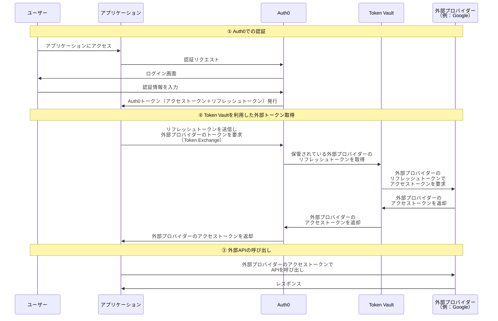

## はじめに
少し前にAuth0が[Token Vault](https://auth0.com/docs/secure/tokens/token-vault)を発表しました。
私がToken Vaultを見つけたのはAIエージェント関連の文脈だったので、最初はAI専用の機能かと思っていました。
しかし、実際に触ってみるともちろんAIの文脈で使えることは間違いないのですが、必ずしもAIと密結合ではないことが分かりました。
ざっくり言うと、Auth0が発行するトークンと外部プロバイダーのトークン交換を行ってくれる便利なストアです。

なので、この記事ではToken Vaultの概要・内部フロー・ユースケース・触ってみた所感を記載します。
自分で試すことができるリポジトリも作ったので、ぜひ活用してください。

https://github.com/maronnjapan/sample-id-app/tree/auth0-token-vault

:::message
本記事はAuth0をすでに利用されている方を対象としています。
OAuth 2.0やリフレッシュトークンの基本的な概念は既知として説明を進めます。
:::

## Token Vaultとは
Token Vaultはトークン専用のシークレットストアです。
ただし、一般的なシークレットストアとは役割が異なります。

一般的なシークレットストア（AWS Secrets Manager、HashiCorp Vaultなど）は、シークレットの安全な保管・バージョニング・ローテーションなど「安全な保存」に主眼があります。
一方Token Vaultは、安全に保存することに加え「トークン交換（Token Exchange）」を前提とした機能を持っています。

具体的には、Auth0で認証されたユーザーに対して発行されるトークンを起点として、外部プロバイダー（GoogleやGitHubなど）用のトークンを取得する仕組みを提供します。
主にリフレッシュトークンを起点として外部プロバイダー用のトークンを取得します。
Auth0が発行するリフレッシュトークンをToken Vaultに渡すことで、外部プロバイダーのトークンが取得できるイメージです。

一度外部プロバイダーとの連携を行えば、その後はリフレッシュトークンを用いてトークン取得が可能になるため、都度ユーザーに再認証を求める必要はありません。

なお、SPAなどリフレッシュトークンの保持が難しいケースでは、アクセストークンを使用するパターンもあります。

### RFC 8693（OAuth 2.0 Token Exchange）について
Token Vaultは[OAuth 2.0 Token Exchange（RFC 8693）](https://www.rfc-editor.org/rfc/rfc8693.html)をベースにしています。
RFC 8693は雑にまとめると、あるトークンを別のトークンに交換するための仕様です。
権限の委譲や別のユーザーへのなりすましを行うためのトークンを、既存のトークンから生成する仕組みを定義しています。

Token Vaultの文脈では、Auth0が発行したリフレッシュトークン（またはアクセストークン）を起点として、外部プロバイダーのアクセストークンを取得するためにこの仕様が活用されています。

:::message
RFC 8693についてより詳しく知りたい方は、以下川崎さんの記事が参考になります。
https://qiita.com/TakahikoKawasaki/items/d9be1b509ade87c337f2
また、以前私が書いたKeycloakでToken Exchangeを試す記事でも触れていますので、合わせてご覧ください。
https://zenn.dev/maronn/articles/token-exchnage-with-keycloak
:::

### Token Vaultの内部フロー
ここでは、Token Vaultを利用して外部プロバイダーのトークンを取得するまでの流れを確認します。

#### 前提：外部プロバイダーとの連携（初回のみ）
Token Vaultを利用するためには、事前にAuth0側で外部プロバイダー（例：Google）との連携設定が必要です。
この設定では、外部プロバイダーのOAuth Client IDやClient Secretの登録と、取得したいトークンの種類（スコープ）を決定します。
ユーザーが初回の連携を行うと、Auth0が外部プロバイダーとのOAuth認可フローを実行し、取得したリフレッシュトークンなどをToken Vaultに保管します。

この初回連携の設定が、後述するCross App Accessとの違いにも関わってくるので、頭の片隅に置いておいてください。

#### トークン取得のフロー

フローの流れを整理すると以下の通りです。

1. **Auth0での認証**：ユーザーがアプリケーションにログインし、Auth0からトークン（アクセストークン＋リフレッシュトークン）を取得します。
2. **Token Vaultを利用した外部トークン取得**：アプリケーションがAuth0のリフレッシュトークンを送信し、Token Exchange（RFC 8693ベース）を通じて外部プロバイダーのアクセストークンを取得します。Token Vault内部では、初回連携時に保管した外部プロバイダーのリフレッシュトークンを使って、外部プロバイダーから新しいアクセストークンを取得しています。
3. **外部APIの呼び出し**：取得した外部プロバイダーのアクセストークンを使って、外部APIを呼び出します。

ポイントは、②のフェーズでユーザーの操作が一切不要なことです。
初回の連携さえ済んでいれば、Auth0のリフレッシュトークンを渡すだけで外部プロバイダーのアクセストークンが取得できます。
ここが便利なところかなと思います。

:::message
本記事では概念理解を優先しています。正確な仕様については[公式ドキュメント](https://auth0.com/ai/docs/intro/token-vault#what-is-token-vault)を参照してください。
:::

## Token Vaultのユースケース
基本的に「Auth0で認証されたアプリケーションが外部APIを利用する場合」に活用できる仕組みだと考えています。
ここでは代表的なユースケースを概念レベルで紹介します。

### AIエージェント
近年最も分かりやすいユースケースの一つかなと思います。
AIエージェントは自律的に動作し、ユーザーに代わって外部APIを呼び出すケースが多いです。
そのたびにユーザーに認証を求めるフローはUX的に現実的ではありません。

Token Vaultを利用すると、一度外部プロバイダーとの連携を行えば、リフレッシュトークンを用いて外部トークンの取得が可能になります。
その結果、人間の操作を減らしつつセキュリティを担保したAPI呼び出しが実現できます。

Auth0が[AI Agent向けドキュメント](https://auth0.com/ai/docs)を提供しているのも、このユースケースを強く意識しているためだと思われます。

### API Gatewayを用いた外部API統合
複数のSaaSや外部APIを統合的に扱うシステムでは、API Gatewayを用意するケースがあります。
クライアントやバックエンドは、そのAPI Gatewayに対してリクエストを送ります。
API GatewayはAuth0のトークンを受け取り、それを元にToken Vaultを利用して外部プロバイダーのトークンを取得します。

例えば以下のような構成が考えられます。

1. リクエストに「利用するプロバイダー（例：Google / GitHubなど）」の情報が含まれる
2. API GatewayがToken Vaultを利用して該当プロバイダーのトークンを取得
3. 外部APIを呼び出し、取得したデータをレスポンスとして返す

この構成であれば、呼び出し元はAPI Gatewayを叩くだけで外部サービスのデータを取得できます。
外部APIごとの認証処理やトークン取得ロジックを各サービス側で実装する必要がなくなるので、そこは楽になりそうです。

## アプリのセットアップ
Token Vaultを実際に試すためのサンプルリポジトリを用意しました。
セットアップ手順については、以下のREADMEを参照してください。

https://github.com/maronnjapan/sample-id-app/tree/auth0-token-vault

Auth0、Auth0 CLI、Cloudflare、wranglerコマンド、terraformコマンドが設定できていれば、スクリプト実行で環境構築が可能です。
ただし、GoogleのOAuthクライアントについては別途手動での作成が必要です。

## Token Vaultを触った所感
最後に、Token Vaultを実際に触ってみて感じたことをダラダラと書いていきます。

### Cross App Accessの簡易版という印象
Token Vaultを触った最初の印象は、[Cross App Access](https://oauth.net/cross-app-access/)（XAA）の簡易版のようだなということでした。

Cross App Accessにおけるトークン交換をIdP起因で行うという思想は似ていますし、必要なトークン取得処理をシステム側が肩代わりするという点でも共通点があります。
AIエージェントなど、システム間通信が増えている現状に対応した仕組みだなと感じました。

### ただしCross App Accessと同一視するのは危険
とはいえ、Token VaultとCross App Accessをかなり似た仕組みとして捉えるのは危険だと思っています。

Cross App Accessは実行するサービスごとに細かく権限を分離しながらトークンを交換できます。
つまり、実行のコンテキストに応じて権限を設定できるのがCross App Accessの特徴です。

一方Token Vaultは、最初に外部プロバイダーと連携する際に保持するトークンの種類（スコープ）を決定します。
その後は、その設定に基づいてトークンを取り出す仕組みです。
実行時のコンテキストに応じて権限を動的に変更するといった用途は、正直難しそうです。

Token Vaultの肝は「外部プロバイダーのトークンを安全かつ簡易に取り出せること」であって、権限管理の文脈で語るものではないと考えています。
そのため、思想が似ている部分はあるものの、Cross App Accessと同一視してしまうのは危険かなと。

なお、そもそも公式ドキュメントでもToken VaultはOAuth 2.0 Token Exchange（RFC 8693）をベースにしていると[説明されています](https://auth0.com/ai/docs/intro/token-vault#what-is-token-vault)。
Cross App Accessが独自の仕様体系（Identity Assertion Authorization Grantなど）を持つのとは、技術的な基盤も異なります。

:::message
Cross App Accessについて詳しく知りたい方は、以前書いた記事も参考にしてください。
https://zenn.dev/maronn/articles/about-cross-app-access
:::

### 認証の代替ではない
これは触っている時に自分自身少し混乱したポイントです。

Token Vaultの設定ではGoogleアカウントなど外部プロバイダーとの連携を行います。
また、フローを見るとAuthorization Code Flowに似ている部分もあります。
そのため「認証の代替として使えるのでは？」と感じてしまう可能性があります。

しかし、実際にはToken Vaultを利用するためにはAuth0のトークンが必要です。
つまり、Auth0での認証が完了していることが前提となります。
Token Vaultは認証そのものを行う仕組みではなく、あくまで「認証済みのユーザーに対して外部トークンを取得する仕組み」です。

フローが認証に似ているからといって、認証の代わりに使えるものではないので、ここは注意が必要です。

## おわりに
今回はAuth0のToken Vaultについて、概要・内部フロー・ユースケース・所感をまとめました。

AIエージェントの文脈で注目されがちなToken Vaultですが、本質は「Auth0のトークンを起点に外部プロバイダーのトークンを安全かつ簡易に取得できる仕組み」だと思っています。
AIに限らず、外部APIとの統合が必要なシステムであれば活用の余地はあるかなと感じました。

一方で、Cross App Accessのような権限管理の仕組みとは明確に異なるので、用途に応じた使い分けは必要です。

サンプルリポジトリも公開しているので、ぜひ実際に触ってみてください。

https://github.com/maronnjapan/sample-id-app/tree/auth0-token-vault

ここまで読んでいただきありがとうございました。
