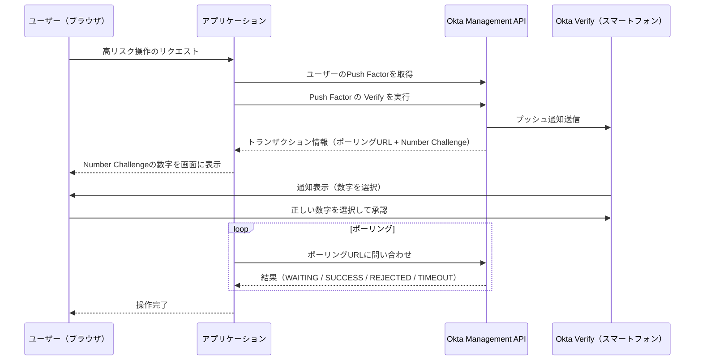
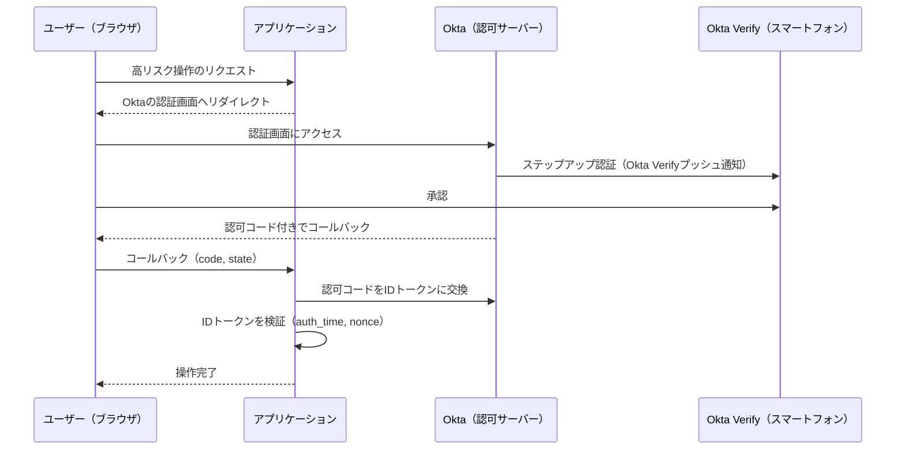

## はじめに
高リスクな操作（例：高額決済）を実行する前に、ユーザーに承認を求めたいというケースがあります。このようなユースケースで最初に候補に上がるのが CIBA（Client Initiated Backchannel Authentication）です。
CIBAは、操作を開始するデバイス（Consumption Device）とは別のデバイス（Authentication Device）で認証・承認を行える仕組みで、リダイレクトを必要としないバックチャネル認証フローです。
銀行での高額取引の承認や、企業の管理者が従業員の操作を承認するようなシーンでの利用ができ、ユーザー体験を損なわずにセキュリティを強化できる点が魅力です。
しかし、OktaでCIBAを実現しようとすると、ライセンスやカスタムAuthenticatorの開発といったハードルがあります。
そこで本記事では、OktaでCIBAが使えない場合の代替手段として、以下の2つのアプローチについて見ていきます。
1. User Factor API によるプッシュ通知承認
2. OIDC による再認証

どちらも一長一短はありますが、OktaのCIBAを用意するのが難しい場合の選択肢として参考になればと思います。

## CIBAの概要
まず前提として、CIBAの登場人物をざっくり整理します。
| 用語 | 説明 |
|---|---|
| Consumption Device (CD) | CIBAを開始するデバイス。例：PCのブラウザ |
| Authentication Device (AD) | 実際に承認を行うデバイス。例：スマートフォン |
| auth_req_id | 一連のCIBAフローであることを示すトランザクションID |
| binding_message | 承認するユーザーが「何の承認か」を確認するためのメッセージ |
| user_code | CDがCIBAを開始するために入力するコード。 |

CIBAの重要な特徴は、リダイレクトを必要とせずバックチャネルで認証を開始でき、操作する人と承認する人が異なるデバイスにいても成立する点です。
これによって、例えばPCで高額取引を開始したユーザーが、スマートフォンで取引内容を確認して承認する、といったシナリオが実現できます。
その他技術的な詳細やユースケースについては以下の仕様を参照してください。
https://openid.net/specs/openid-client-initiated-backchannel-authentication-core-1_0.html
## OktaでCIBAをやるには
OktaでCIBAを実現するには、以下のいずれかが必要です。
### カスタム認可サーバーを使う場合
- Okta のカスタム認可サーバーでCIBAを利用するには、別途ライセンスが必要
- 標準ライセンスでは利用できないため、コスト面でのハードルがある
### Org 認可サーバーを使う場合
- Org 認可サーバーでCIBAを利用するには、カスタムAuthenticator の開発が必要
- プッシュ通知機能を搭載した独自アプリを構築する必要があり、実装コストが非常に高い

いずれの方法も、コストや実装の複雑さを考えるとOktaでCIBAを実現するためのハードルが高いのが現状です。
潤沢な資金や、Oktaのカスタム開発に精通したチームがあれば別ですが、そうでない場合は他の方法を検討する必要があります。
なので、特定のケース限定ではありますが、OktaでCIBAの導入が難しい場合の代替手段を考えてみたので記載します。
## OktaでCIBAの代わりを考える
CIBAそのものの実装が難しくても、「特定の操作前にユーザーの承認を得て操作を続行する」というケースに限定すれば、満たすべき要件は以下の2点に整理できます。
1. ユーザーによる承認操作 が行われたこと
2. 通知が特定の操作に対するものであること の担保

これを満たす方法として、以下の2つのパターンが考えられます。
| アプローチ | 概要 |
|---|---|
| User Factor API + プッシュ通知 | Okta Verifyにプッシュ通知を送り、承認されたら操作を実行する |
| OIDC による再認証 | Oktaの認証画面にリダイレクトさせ、再認証が完了したら操作を実行する |

以降、それぞれのアプローチについて解説します。
## パターン1：User Factor API を使ったプッシュ通知による承認
### 考え方
Okta の [User Factor API](https://developer.okta.com/docs/api/openapi/okta-management/management/tag/UserFactor/#tag/UserFactor/operation/verifyFactor) は、Okta Management API の一部で、ユーザーに紐付いた認証要素（Factor）を操作できます。
この中の Push Factor の Verify を使うと、Okta Verify アプリにプッシュ通知を送信できます。
このプッシュ通知の仕組みを「承認フロー」として転用するのが、パターン1のアイデアです。
### フロー

Okta Management APIでアプリとOktaの間でやりとりを行い、Okta Verifyにプッシュ通知を送る点が特徴的です。
### 仕組みの詳細
#### Management APIへのアクセス
User Factor APIはManagement APIの一部なので、利用するにはサービスアカウント（OAuthクライアント）を作成し、`client_credentials` グラントでアクセストークンを取得する必要があります。
認証方式には `private_key_jwt` を使用し、必要なスコープ（`okta.users.read`、`okta.factors.read`、`okta.factors.manage` など）とロール（`HELP_DESK_ADMIN`）を付与します。
認証方式について`private_key_jwt`は必須ではありませんが、今回のユースケースではセキュアであることが求めらると思います。
そのため、クライアントシークレットを使う方式は避け、公開鍵暗号方式の `private_key_jwt` を選択しています。
#### プッシュ通知の送信
ユーザーのメールアドレスからユーザーIDを特定し、そのユーザーに紐付いたPush Factor（Okta Verify）のIDを取得して、Verify APIを呼び出します。このとき、レスポンスにはポーリング用のURLとトランザクションの有効期限が返されます。
#### ポーリングによる結果確認
プッシュ通知を送信した後、アプリケーション側はポーリング用URLに定期的にリクエストを送り、ユーザーの操作結果を確認します。
結果は以下のいずれかです。
| factorResult | 意味 |
|---|---|
| `WAITING` | ユーザーがまだ操作していない |
| `SUCCESS` | ユーザーが承認した |
| `REJECTED` | ユーザーが拒否した |
| `TIMEOUT` | 有効期限が切れた |

`SUCCESS` が返されたら、操作を実行します。
### Number Challengeの役割
プッシュ通知を送信する際に Number Challenge を有効にすると、レスポンスに正解の数字（`correctAnswer`）が含まれます。
この数字をサービス側の画面に表示し、ユーザーにはOkta Verify上で同じ数字を選択させます。
これはCIBAにおける `binding_message` の代替として使用することを意図しています。
サービス側の画面に表示された数字とOkta Verify上の数字を照合させることで、想定外のプッシュ通知を誤って承認してしまうリスクを低減できることを期待しています。
ただし、CIBAの `binding_message` のようなカスタムメッセージ（例：「商品Aの購入 ¥10,000」）ではないため、その通知が何の承認なのかを示すには、アプリケーション側の画面で補足するなど別途対応が必要です。
CIBAに比べたら何の通知かを判断する必要があるので、ユーザーへの負荷は高くなります。
その点は課題ですが、CIBAの `binding_message` が使えない中で、ユーザーが承認操作を行う際の最低限の担保としては機能すると思います。

### CIBAとの対応関係
User Factor APIの仕組みをCIBAと対比すると、以下のようになります。
| CIBAの概念 | User Factor APIでの対応 |
|---|---|
| auth_req_id（トランザクションID） | ポーリングURL内のトランザクションID |
| Authentication Device | Okta Verifyがインストールされたスマートフォン |
| Consumption Device | アプリケーション（ブラウザ等） |
| binding_message | Number Challenge（数字のみ、カスタムメッセージ不可） |
| user_code | なし（独自に実装が必要） |
### 利点と欠点
利点と欠点は以下の通りです。
利点
- リダイレクトを必要としないため、操作中のユーザーとは別のデバイスに通知を送れる
- 所有しているデバイスでの操作が前提であり、CIBAの思想に近い

欠点
- Okta独自APIを使用するため、セキュリティの担保が実装者に委ねられる
- `binding_message` が使えないため、何の承認なのかをユーザーが判断しにくい
## パターン2：OIDC による再認証
### 考え方
承認を求める際に、OIDCの認可フローを使ってOktaのログイン画面にリダイレクトし、再度認証を行います。
認証が完了するとIDトークンが発行されるので、その中の `auth_time`（認証時刻）や `nonce` を検証することで、「この操作のために今認証された」ことを確認します。
認証が確認できたら、承認済みとして操作を実行します。
### フロー

リダイレクトする時のクエリパラメータに別途設定が必要ですが、基本的には標準的なOIDCやSAMLのフローとなります。
このフローではOIDCでのフローとなっています。
### 仕組みの詳細
#### 再認証の強制
通常のOIDCフローでは、Oktaにすでにセッションがあればそのまま認証済みとして扱われます。承認フローとして利用するには、毎回必ず再認証させる 必要があります。
これを実現するために、認可リクエストに以下のパラメータを指定します。
- `max_age=0`：既存のセッションを無視して、必ず再認証を要求する
- `acr_values=urn:okta:loa:2fa:any`：2要素認証（パスワード＋Okta Verify等）を要求する

`acr_values=urn:okta:loa:2fa:any`については、Oktaの認証ポリシー側で2要素認証を要求するルールを作成しれいれば無くてもよいかもしれません。  
ただ、これを指定しておくと、認可リクエストの段階で「このアプリは2要素認証が必要」ということが明示されるので設定した方がよいと思います。

#### ステップアップ認証ポリシー
Okta側では、このアプリに対する認証ポリシーとしてステップアップ認証を設定します。具体的には以下の2要素を要求するルールを作成します。
- knowledge（知識要素）：パスワード
- possession（所持要素）：Okta Verifyなどのデバイス認証（`userVerification = "REQUIRED"`）
このポリシーをOAuthクライアントに紐付けることで、認証時にOkta Verifyのプッシュ通知による承認が強制されます。
#### 操作とのトランザクション紐付け
再認証が「この操作のために行われたもの」であることを担保するために、以下の仕組みを使います。
- `state` パラメータ：操作のID（例：支払いID）を `state` に含め、コールバック時に操作レコードと紐付ける
- `nonce`：操作開始時にランダムな値を生成し、認可リクエストに含める。IDトークン内の `nonce` と一致することを確認し、リプレイ攻撃を防ぐ
- `auth_time` の検証：IDトークン内の `auth_time`（実際に認証が行われた時刻）が、操作のリクエスト時刻と大きく乖離していないことを確認する。これにより、古い認証結果の流用を防ぐ
### 利点と欠点
利点と欠点は以下の通りです。
利点
- OIDC標準仕様に従っているため、認証が適切に行われたことの担保がしやすい
- IDトークンの `auth_time`、`acr`、`amr` など、認証コンテキストを詳細に確認できる

欠点
- リダイレクトが必要なため、操作しているユーザー本人しか再認証ができない（第三者による承認は不可）
- 再認証用のコールバックエンドポイントを用意する必要があり、通常のログインフローとの切り分けが必要
## 2つのアプローチの比較
| 観点 | User Factor API | OIDC 再認証 |
|---|---|---|
| リダイレクト | 不要 | 必要 |
| 承認者 | 任意のユーザー（メールアドレス指定） | 操作中のユーザー本人のみ |
| 標準仕様準拠 | Okta独自API | OIDC標準 |
| セキュリティ担保 | 実装者に委ねられる | IDトークン検証による担保 |
| 操作の識別 | Number Challengeのみ（カスタムメッセージ不可） | `nonce` + `auth_time` で紐付け |
| CIBAとの類似度 | 高い（バックチャネル＋デバイス承認） | 低い（フロントチャネル） |
## おわりに
今回は、OktaでCIBAが使えない場合の代替手段として、User Factor APIを使ったプッシュ通知承認と、OIDCによる再認証の2つのアプローチを紹介しました。
OktaでCIBAを実現するにはライセンスやカスタムAuthenticatorの開発が必要で、ハードルが高いのが現状です。
しかし、「特定の操作時にユーザーの承認を挟みたい」という要件であれば、以下のように使い分けることで代替できます。
- CIBAに近い体験を求めるなら → User Factor API によるプッシュ通知承認
  - リダイレクト不要で、操作者以外のデバイスにも通知を送れる
  - ただしOkta独自APIへの依存と `binding_message` 非対応は課題
- 標準仕様に準拠したい、認証の担保を重視するなら → OIDCによる再認証
  - IDトークンによる検証で安全性を担保しやすい
  - ただしリダイレクトが必要で、承認者は操作中の本人に限られる

どちらのアプローチにも課題はありますが、CIBAが使えない環境でも一考の余地はあると思います。
もし同じような悩みを抱えている方がいれば、この記事が参考になれば幸いです。
ちなみに後日実装の詳細は記事にしようと思っていますが、以下にサンプルプロジェクトがあります。
https://github.com/maronnjapan/sample-id-app/tree/ciba-with-okta
scripts/deploy-stack.shを実行できればセットアップできるので、ぜひ試してみてください。
ここまで読んでいただきありがとうございました。
